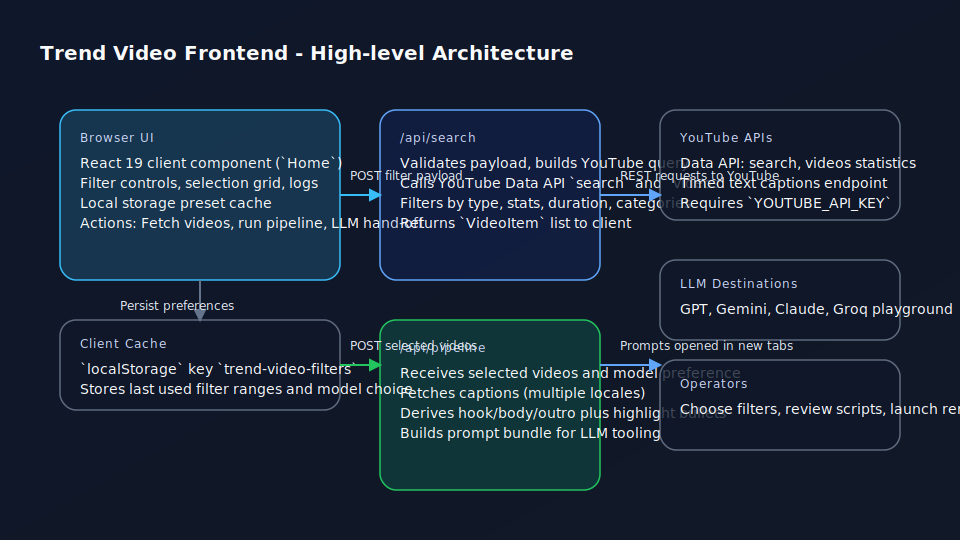

# Trend Video Frontend



---

## 📋 기능 스펙 및 개발 가이드

**구현된 기능의 상세 스펙을 확인하려면 [기능목록.md](./기능목록.md)를 참조하세요.**

이 문서에는 다음과 같은 정보가 포함됩니다:
- 상품 자동화 기능 (쿠팡 베스트셀러 자동 등록)
- 각 기능의 구현 위치 및 동작 흐름
- 관련 파일 및 API 엔드포인트

---

## 🛒 쿠팡 쇼핑몰 무료 배포

**클릭 한 번으로 Vercel에 배포하세요!** (완전 무료, 월 100만 방문자 지원)

[](https://vercel.com/new/clone?repository-url=https://github.com/your-username/trend-video-frontend&env=ADMIN_SERVER_URL&envDescription=관리%20서버%20URL%20입력&envLink=https://github.com/your-username/trend-video-frontend/blob/master/VERCEL_DEPLOYMENT_GUIDE.md)

**환경 변수 설정**:
- `ADMIN_SERVER_URL`: `http://oldmoon.iptime.org`

📖 **상세 가이드**: [VERCEL_DEPLOYMENT_GUIDE.md](./VERCEL_DEPLOYMENT_GUIDE.md)

---

## Overview
- Single-page Next.js 16 (App Router) application built with React 19 and TypeScript.
- Focused on finding high-potential YouTube videos, filtering them, and handing selected items to an automation pipeline.
- Styling is implemented with the Tailwind CSS v4 beta PostCSS plugin and custom gradients defined in `globals.css`.

## Layered Architecture
- **Presentation (src/app/page.tsx)**: Client component coordinates filters, state, and UI feedback. Uses local storage to persist filter presets (`trend-video-filters`).
- **Search API (src/app/api/search/route.ts)**: Server action that proxies the YouTube Data API `search` and `videos` endpoints. Applies quota-friendly caching directives (`cache: "no-store"`), normalises results, and enriches them with statistics required by the UI.
- **Pipeline API (src/app/api/pipeline/route.ts)**: Lightweight content generator. Fetches subtitles from YouTube timed text, derives heuristics, and crafts LLM-ready prompts and thumbnail prompts for downstream tools.
- **Shared Types (src/types/video.ts)**: Canonical `VideoItem`, filter enums, and shared option literals.

## Runtime Flow
1. User adjusts filters (type, view/subscriber ranges, category, duration, title search) inside `Home` component.
2. `fetchVideos` posts the active filter payload to `/api/search`. The route expands a YouTube query, filters out low-signal items, and returns an array of `VideoItem` objects.
3. The client memoises `filteredVideos`, supports manual selection, and exposes actions for automation.
4. `runPipeline` posts the selected subset to `/api/pipeline`. The route optionally fetches transcripts, creates summary scripts, highlight bullets, and thumbnail prompts.
5. Based on the chosen action:
   - **Automation preview**: Presents the generated scripts inside an alert and logs the run.
   - **LLM hand-off**: Opens tabs for GPT, Gemini, Claude, or Groq with prefilled prompts via `composeLLMPrompt` and `openModelTab`.

## State and Data Management
- React hooks manage all filter and fetch state; derived collections use `useMemo` to avoid unnecessary recomputation.
- `pushLog` maintains a bounded activity log (50 entries) for API calls and pipeline results.
- Duration filtering supports both API-provided seconds and fallback ISO 8601 parsing (`parseIsoDurationLocal`).
- Date filtering logic is duplicated client-side (`matchesDateFilterLocal`) to keep UI responsiveness even when the API returns extra data.

## External Dependencies and Configuration
- Requires `YOUTUBE_API_KEY` in `.env.local` for the `/api/search` route. Missing keys return informative HTTP 500 responses.
- Uses the built-in `fetch` polyfill provided by Next.js in both client and server environments.
- Default YouTube query is `korea trending`; adjust the constant in `/api/search/route.ts` for different markets.

## Coupang Partners Integration
- **Full affiliate marketing suite** integrated at `/coupang` route
- **Product search** via Coupang OpenAPI
- **Deep link generation** for affiliate commission tracking
- **Link management** and statistics dashboard
- See [COUPANG_QUICKSTART.md](./COUPANG_QUICKSTART.md) for setup and [COUPANG_PARTNERS_GUIDE.md](./COUPANG_PARTNERS_GUIDE.md) for detailed documentation

## Project Layout
```
trend-video-frontend/
|- public/                     # Static assets and generated diagrams
|- src/
|  |- app/
|  |  |- api/search/route.ts   # Search proxy and filtering pipeline
|  |  |- api/pipeline/route.ts # Narrative and thumbnail generator
|  |  |- layout.tsx            # Root layout and metadata
|  |  |- page.tsx              # Main UI (filters, grid, pipeline actions)
|  |- types/video.ts           # Shared DTOs and enums
|- next.config.ts              # Next.js configuration (image domains, etc.)
|- eslint.config.mjs           # ESLint plus Next.js preset
|- tsconfig.json               # TypeScript compiler options
|- package.json                # Scripts and dependency versions
```

## Development Scripts
- `npm install` - install dependencies.
- `npm run dev` - launch the Next.js dev server on port 3000.
- `npm run lint` - run ESLint with the Next.js config.
- `npm run build` / `npm run start` - production build and boot.

## Generated Artefacts
- `public/architecture-overview.svg` - high-level component and request flow diagram.
- `docs/architecture-overview.pdf` - printable snapshot of this architecture overview.
