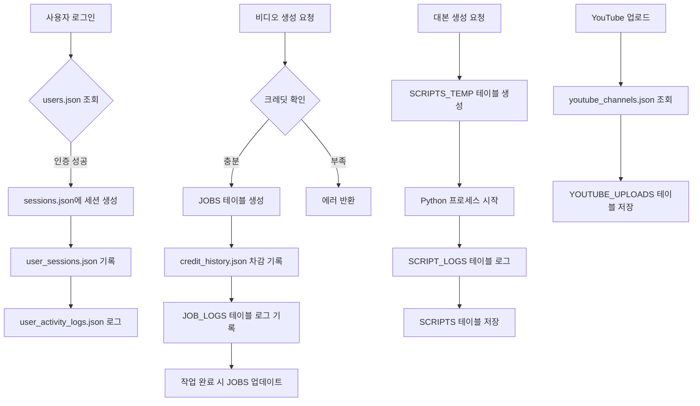

# 데이터베이스 ERD (Entity Relationship Diagram)

## 📊 저장소 구분
- 🗄️ **SQLite**: 구조화된 관계형 데이터
- 📄 **JSON File**: 간단한 파일 기반 저장소

---

## 1. 전체 ERD

```mermaid
erDiagram
    %% SQLite Tables
    USERS ||--o{ SESSIONS : "has many"
    USERS ||--o{ JOBS : "has many"
    USERS ||--o{ SCRIPTS : "has many"
    USERS ||--o{ CREDIT_HISTORY : "has many"
    USERS ||--o{ CHARGE_REQUESTS : "has many"
    USERS ||--o{ USER_ACTIVITY_LOGS : "has many"
    USERS ||--o{ FOLDERS : "has many"
    USERS ||--o{ YOUTUBE_UPLOADS : "has many"

    JOBS ||--o{ JOB_LOGS : "has many"
    SCRIPTS ||--o{ SCRIPT_LOGS : "has many"
    TASKS ||--o{ TASK_LOGS : "has many"

    %% Users (SQLite)
    USERS {
        TEXT id PK "🗄️ SQLite"
        TEXT email UK
        TEXT password
        INTEGER is_admin
        INTEGER credits
        INTEGER is_email_verified
        TEXT verification_token
        TEXT memo
        TEXT created_at
        TEXT updated_at
    }

    %% Sessions (SQLite)
    SESSIONS {
        TEXT id PK "🗄️ SQLite"
        TEXT user_id FK
        TEXT expires_at
        TEXT created_at
    }

    %% Jobs (SQLite)
    JOBS {
        TEXT id PK "🗄️ SQLite"
        TEXT user_id FK
        TEXT status "pending|processing|completed|failed|cancelled"
        INTEGER progress
        TEXT step
        TEXT title
        TEXT video_url
        TEXT error
        TEXT thumbnail_path
        TEXT type "longform|shortform|sora2"
        TEXT created_at
        TEXT updated_at
    }

    %% Job Logs (SQLite)
    JOB_LOGS {
        INTEGER id PK "🗄️ SQLite (AUTO)"
        TEXT job_id FK
        TEXT log_message
        TEXT created_at
    }

    %% Scripts (SQLite)
    SCRIPTS {
        TEXT id PK "🗄️ SQLite"
        TEXT user_id FK
        TEXT title
        TEXT content
        TEXT status "pending|processing|completed|failed"
        INTEGER progress
        TEXT error
        INTEGER input_tokens
        INTEGER output_tokens
        TEXT original_topic
        TEXT type "longform|shortform|sora2"
        TEXT created_at
        TEXT updated_at
    }

    %% Script Logs (SQLite)
    SCRIPT_LOGS {
        INTEGER id PK "🗄️ SQLite (AUTO)"
        TEXT script_id FK
        TEXT log_message
        TEXT created_at
    }

    %% Scripts Temp (SQLite)
    SCRIPTS_TEMP {
        TEXT id PK "🗄️ SQLite"
        TEXT title
        TEXT status "PENDING|PROCESSING|COMPLETED|FAILED"
        TEXT message
        TEXT createdAt
        TEXT scriptId
        TEXT logs "JSON Array"
        TEXT type
        INTEGER pid "Python Process ID"
    }

    %% Credit History (SQLite)
    CREDIT_HISTORY {
        TEXT id PK "🗄️ SQLite"
        TEXT user_id FK
        INTEGER amount "양수: 증가, 음수: 감소"
        TEXT type "charge|use|refund"
        TEXT description
        INTEGER balance_after
        TEXT created_at
    }

    %% Charge Requests (SQLite)
    CHARGE_REQUESTS {
        TEXT id PK "🗄️ SQLite"
        TEXT user_id FK
        INTEGER amount
        TEXT status "pending|approved|rejected"
        TEXT created_at
        TEXT processed_at
    }

    %% User Activity Logs (SQLite)
    USER_ACTIVITY_LOGS {
        INTEGER id PK "🗄️ SQLite (AUTO)"
        TEXT user_id FK
        TEXT action "login|logout|generate_video..."
        TEXT details
        TEXT created_at
    }

    %% Folders (SQLite)
    FOLDERS {
        TEXT id PK "🗄️ SQLite"
        TEXT user_id FK
        TEXT name
        TEXT color "기본: #8B5CF6"
        TEXT created_at
        TEXT updated_at
    }

    %% Tasks (SQLite)
    TASKS {
        TEXT id PK "🗄️ SQLite"
        TEXT content
        TEXT status "todo|ing|done"
        INTEGER priority
        TEXT logs
        TEXT created_at
        TEXT updated_at
        TEXT completed_at
    }

    %% Task Logs (SQLite)
    TASK_LOGS {
        INTEGER id PK "🗄️ SQLite (AUTO)"
        TEXT task_id FK
        TEXT log_message
        TEXT created_at
    }

    %% YouTube Uploads (SQLite)
    YOUTUBE_UPLOADS {
        TEXT id PK "🗄️ SQLite"
        TEXT user_id FK
        TEXT job_id FK
        TEXT video_id
        TEXT video_url
        TEXT title
        TEXT description
        TEXT thumbnail_url
        TEXT channel_id
        TEXT channel_title
        TEXT privacy_status
        TEXT published_at
        TEXT created_at
    }

    %% Settings (SQLite)
    SETTINGS {
        INTEGER id PK "🗄️ SQLite (AUTO)"
        INTEGER ai_script_cost "기본: 25"
        INTEGER video_generation_cost "기본: 50"
        TEXT updated_at
    }
```



---

## 2. JSON 파일 저장소 (File-based)

### 📄 JSON Files Structure

```
data/
├── users.json                    📄 사용자 데이터 (1KB)
├── sessions.json                 📄 세션 관리 (4KB)
├── user_sessions.json            📄 세션 히스토리 (7KB)
├── user_activity_logs.json       📄 활동 로그 (7KB)
├── credit_history.json           📄 크레딧 히스토리 (29KB)
├── charge_requests.json          📄 충전 요청 (2KB)
├── settings.json                 📄 설정 (1KB)
├── youtube_channels.json         📄 YouTube 채널 (1KB)
├── prompts.json                  📄 프롬프트 템플릿 (2KB)
└── scripts.json                  📄 (비어있음 - SQLite 사용)
```

---

## 3. JSON 파일 상세 스키마

### 3.1 users.json (📄 JSON File)
```typescript
interface UserJSON {
  id: string;                      // UUID
  email: string;                   // 로그인 ID
  password: string;                // SHA256 해시
  name: string;                    // 사용자 이름
  phone: string;                   // 전화번호
  address: string;                 // 주소
  kakaoId?: string;                // 카카오톡 ID (선택)
  emailVerified: boolean;          // 이메일 인증 여부
  emailVerificationToken?: string; // 인증 토큰
  credits: number;                 // 크레딧 잔액
  isAdmin: boolean;                // 관리자 여부
  adminMemo?: string;              // 관리자 메모
  createdAt: string;               // ISO 8601 날짜
}
```

---

### 3.2 sessions.json (📄 JSON File)
```typescript
interface SessionsJSON {
  [sessionId: string]: {
    userId: string;
    email: string;
    isAdmin: boolean;
    expiresAt: number;             // Timestamp (밀리초)
  };
}
```

**예시:**
```json
{
  "959413a3-15a0-4818-82b2-5c97600b9740": {
    "userId": "b5d1f064-60b9-45ab-9bcd-d36948196459",
    "email": "moony75@gmail.com",
    "isAdmin": true,
    "expiresAt": 1762240348566
  }
}
```

---

### 3.3 user_sessions.json (📄 JSON File)
```typescript
interface UserSessionJSON {
  id: string;                      // UUID
  userId: string;
  userEmail: string;
  loginAt: string;                 // ISO 8601
  lastActivityAt: string;
  logoutAt?: string;
  ipAddress?: string;
  userAgent?: string;
  isActive: boolean;               // 현재 활성 세션
}
```

---

### 3.4 credit_history.json (📄 JSON File - 29KB, 약 1,000건)
```typescript
interface CreditHistoryJSON {
  id: string;                      // UUID
  userId: string;
  type: 'charge' | 'use' | 'refund';
  amount: number;                  // 음수: 차감, 양수: 증가
  balance: number;                 // 거래 후 잔액
  description: string;             // 거래 설명
  createdAt: string;               // ISO 8601
}
```

---

### 3.5 charge_requests.json (📄 JSON File)
```typescript
interface ChargeRequestJSON {
  id: string;                      // UUID
  userId: string;
  userName: string;
  userEmail: string;
  amount: number;                  // 요청 크레딧
  status: 'pending' | 'approved' | 'rejected';
  createdAt: string;               // ISO 8601
  approvedAt?: string;
  approvedBy?: string;             // 승인한 관리자 이메일
  rejectedAt?: string;
  rejectedBy?: string;
  memo?: string;                   // 관리자 메모
}
```

---

### 3.6 settings.json (📄 JSON File)
```typescript
interface SettingsJSON {
  aiScriptCost: number;            // AI 대본 생성 비용 (기본: 100)
  videoGenerationCost: number;     // 영상 생성 비용 (기본: 150)
}
```

---

### 3.7 user_activity_logs.json (📄 JSON File - 161건)
```typescript
interface UserActivityLogJSON {
  id: string;                      // UUID
  userId: string;
  userEmail: string;
  action: string;                  // login|logout|generate_video|upload_youtube...
  details?: string;
  ipAddress?: string;
  userAgent?: string;
  createdAt: string;               // ISO 8601
}
```

---

### 3.8 youtube_channels.json (📄 JSON File)
```typescript
interface YouTubeChannelJSON {
  id: string;                      // UUID
  userId: string;
  channelId: string;               // YouTube 채널 ID
  channelTitle: string;
  thumbnailUrl?: string;
  subscriberCount?: number;
  description?: string;
  tokenFile?: string;              // OAuth 토큰 파일명
  isDefault?: boolean;             // 기본 채널 여부
  createdAt: string;
  updatedAt: string;
}
```

---

### 3.9 prompts.json (📄 JSON File)
```typescript
interface PromptJSON {
  id: string;                      // longform-default|shortform-default|sora2-default
  type: 'longform' | 'shortform' | 'sora2';
  name: string;
  systemPrompt: string;            // AI 시스템 프롬프트
  sceneTemplate: string;           // 씬 템플릿
  dalleTemplate: string;           // DALL-E 프롬프트 템플릿
  updatedAt: string;
}
```

---

## 4. 저장소 선택 기준

| 데이터 유형 | 저장소 | 이유 |
|-----------|-------|------|
| 사용자 기본 정보 | 📄 JSON | 간단한 CRUD, 빠른 접근 |
| 세션 관리 | 📄 JSON | 실시간 조회, 키-값 구조 |
| 작업(Jobs) 데이터 | 🗄️ SQLite | 복잡한 쿼리, 로그 관계 |
| 대본(Scripts) 데이터 | 🗄️ SQLite | 구조화된 데이터, 검색 필요 |
| 크레딧 히스토리 | 📄 JSON | 감사 추적, 단순 조회 |
| 활동 로그 | 📄 JSON | 시계열 데이터, 단순 기록 |
| 설정 | 📄 JSON | 단순 키-값, 자주 변경 |

---

## 5. 데이터 흐름도



---

## 6. 주요 인덱스 (SQLite)

### users 테이블
- `idx_users_email` ON `email`
- `idx_users_verification_token` ON `verification_token`

### sessions 테이블
- `idx_sessions_user_id` ON `user_id`
- `idx_sessions_expires_at` ON `expires_at`

### jobs 테이블
- `idx_jobs_user_id` ON `user_id`
- `idx_jobs_status` ON `status`
- `idx_jobs_created_at` ON `created_at`

### scripts 테이블
- `idx_scripts_user_id` ON `user_id`
- `idx_scripts_status` ON `status`
- `idx_scripts_created_at` ON `created_at`

### job_logs 테이블
- `idx_job_logs_job_id` ON `job_id`

### script_logs 테이블
- `idx_script_logs_script_id` ON `script_id`

### credit_history 테이블
- `idx_credit_history_user_id` ON `user_id`
- `idx_credit_history_created_at` ON `created_at`

### charge_requests 테이블
- `idx_charge_requests_user_id` ON `user_id`
- `idx_charge_requests_status` ON `status`

### user_activity_logs 테이블
- `idx_user_activity_logs_user_id` ON `user_id`
- `idx_user_activity_logs_created_at` ON `created_at`

### folders 테이블
- `idx_folders_user_id` ON `user_id`

### tasks 테이블
- `idx_tasks_status` ON `status`
- `idx_tasks_priority` ON `priority`
- `idx_tasks_created_at` ON `created_at`

### task_logs 테이블
- `idx_task_logs_task_id` ON `task_id`

### youtube_uploads 테이블
- `idx_youtube_uploads_user_id` ON `user_id`
- `idx_youtube_uploads_video_id` ON `video_id`
- `idx_youtube_uploads_published_at` ON `published_at`

---

## 7. 외래 키 제약 (SQLite)

```sql
-- sessions → users
FOREIGN KEY (user_id) REFERENCES users(id)

-- jobs → users
FOREIGN KEY (user_id) REFERENCES users(id)

-- job_logs → jobs (CASCADE DELETE)
FOREIGN KEY (job_id) REFERENCES jobs(id) ON DELETE CASCADE

-- scripts → users
FOREIGN KEY (user_id) REFERENCES users(id)

-- script_logs → scripts (CASCADE DELETE)
FOREIGN KEY (script_id) REFERENCES scripts(id) ON DELETE CASCADE

-- credit_history → users
FOREIGN KEY (user_id) REFERENCES users(id)

-- charge_requests → users
FOREIGN KEY (user_id) REFERENCES users(id)

-- user_activity_logs → users
FOREIGN KEY (user_id) REFERENCES users(id)

-- folders → users
FOREIGN KEY (user_id) REFERENCES users(id)

-- task_logs → tasks (CASCADE DELETE)
FOREIGN KEY (task_id) REFERENCES tasks(id) ON DELETE CASCADE

-- youtube_uploads → users
FOREIGN KEY (user_id) REFERENCES users(id)
```

---

## 8. 데이터 마이그레이션 히스토리

### 과거: 순수 JSON 기반 (jobs.json, scripts.json)
- 문제: 파일 손상, 동시성 문제
- 백업 파일들: `jobs.json.corrupted.*`

### 현재: 하이브리드 (SQLite + JSON)
- SQLite: 구조화된 데이터, 로그
- JSON: 간단한 데이터, 빠른 접근

### 자동 마이그레이션
```typescript
// src/lib/sqlite.ts
initDatabase() {
  // 1. 테이블 존재 확인
  // 2. 없으면 schema-sqlite.sql 실행
  // 3. 인덱스 생성
  // 4. 외래 키 활성화
}
```

---

## 9. 백업 전략

### SQLite 자동 백업
- **위치:** `data/backups/`
- **주기:** 스크립트 실행 전 자동 백업
- **형식:** `database_YYYY-MM-DD_HH-MM-SS_auto_before_script.sqlite`

### JSON 파일 백업
- **수동 백업 권장**
- **Git 버전 관리**

---

## 10. 성능 최적화

### SQLite 최적화
```sql
-- WAL 모드 (Write-Ahead Logging)
PRAGMA journal_mode = WAL;

-- 외래 키 제약 활성화
PRAGMA foreign_keys = ON;

-- 캐시 크기 증가 (메모리 사용)
PRAGMA cache_size = -64000;  -- 64MB

-- 동기화 모드 (성능 vs 안정성)
PRAGMA synchronous = NORMAL;
```

### JSON 파일 최적화
- **스트리밍 JSON 파서** (큰 파일)
- **인덱스 파일** 별도 관리 (필요시)
- **주기적 압축** (로그 파일)

---

## 11. 보안 고려사항

### SQLite
- ✅ 외래 키 제약 활성화
- ✅ Prepared Statements 사용
- ⚠️ 파일 권한 관리 (read/write 제한)

### JSON 파일
- ✅ 민감 정보 암호화 (password: SHA256)
- ⚠️ 파일 권한 관리
- ⚠️ 토큰 파일 별도 저장 (`youtube_token_*.json`)

---

## 12. 트러블슈팅

### 일반적인 문제

#### 1. SQLite 데이터베이스 잠금
```bash
# WAL 모드가 활성화되어 있는지 확인
sqlite3 data/database.sqlite "PRAGMA journal_mode;"
# 출력: wal
```

#### 2. JSON 파일 손상
```bash
# 유효성 검사
node -e "console.log(JSON.parse(require('fs').readFileSync('data/users.json')))"
```

#### 3. 세션 만료
```typescript
// sessions.json 정리 (만료된 세션 삭제)
const sessions = JSON.parse(fs.readFileSync('data/sessions.json'));
const now = Date.now();
const valid = Object.fromEntries(
  Object.entries(sessions).filter(([_, s]) => s.expiresAt > now)
);
fs.writeFileSync('data/sessions.json', JSON.stringify(valid, null, 2));
```

---

## 13. 향후 개선 방향

### 단기
- [ ] Redis 도입 (세션 관리)
- [ ] Elasticsearch 도입 (로그 검색)

### 중기
- [ ] PostgreSQL 마이그레이션 (전체 SQLite → PostgreSQL)
- [ ] 로그 아카이빙 (오래된 로그 압축)

### 장기
- [ ] 클라우드 스토리지 연동 (S3, GCS)
- [ ] 분산 데이터베이스 (샤딩)

---

*Last Updated: 2025-11-04*
*Database Schema Version: 1.0*
